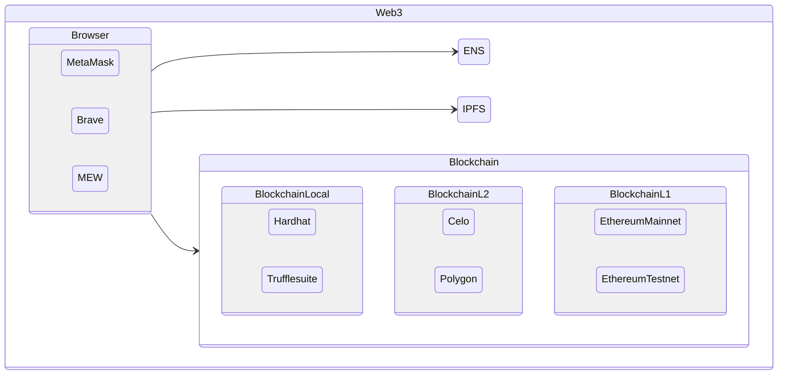

# weekly61

### Environment: local virtual environment 2022

#### First! Virtual Environment to work every day

> *Virtual Environment* help us be out of dependencies
> I mean dependencies from hour local environment for personal use of computer

> *Independent environment* just for the *sanity of the project*, and the others projects

> Clone Base System: Just after create a Simple Operating System Installation ( with or without GUI Desktop )
> Why Clone ? Because I need to check when I have added extra dependencies, or try new things fast.

> Docker: Clearly the end app must be in an environment like Docker, kubernetes, or simple local run docker as utility. Isolation of the environment ( versions of software like.. py2 py3, nodejs14 nodejs15, debian, alpine, libraries )


> ENV: Linux tools for Install to compile from Source Code any application
```tsx
# apt install build-essential linux-headers-amd64
```

> ENV: Download Virtual Box to install from source code, copiling it.
```tsx
https://download.virtualbox.org/virtualbox/6.1.38/VirtualBox-6.1.38-153438-Linux_amd64.run
```

> ENV: Change permision of the file, Executable +x
```tsx
# chmod +x VirtualBox-6.1.38-153438-Linux_amd64.run
```

> ENV: Execute the script that will download and compile from source code virtualbox
```
# ./VirtualBox-6.1.38-153438-Linux_amd64.run 
```

> ENV: Desktop Display config LXDE > Preferences > Monitor Settings > 1280x768 




```tsx
stateDiagram-v2
    state Web3 {
        direction LR
        state Browser {
            direction LR
            MetaMask
            Brave
            MEW
        }
        Browser --> ENS
        Browser --> IPFS
        Browser --> Blockchain
    }
    state Blockchain {
        state BlockchainLocal {
            direction LR
            Hardhat
            Trufflesuite
        }
        state BlockchainL2 {
            direction LR
            Celo
            Polygon
        }
        state BlockchainL1 {
            direction LR
            EthereumMainnet
            EthereumTestnet
        }
    }
```
> Git - source code version control manager / repository to interact with github
```tsx
su -
..
# apt install git
```
> Source Code Editor - vscode in this case.
```tsx
# curl https://packages.microsoft.com/keys/microsoft.asc | gpg --dearmor > microsoft.gpg
# install -o root -g root -m 644 microsoft.gpg /usr/share/keyrings/microsoft-archive-keyring.gpg
# sh -c 'echo "deb [arch=amd64,arm64,armhf signed-by=/usr/share/keyrings/microsoft-archive-keyring.gpg] https://packages.microsoft.com/repos/vscode stable main" > /etc/apt/sources.list.d/vscode.list'
# apt -y update && apt -y upgrade && apt -y install code
# exit
$ code
```

> Create a Folder for Projects
```
$ mkdir projects
$ cd projects
```
> Clone the repository where we are working to have the step by step guide.
```
$ git clone https://github.com/maximilianou/weekly61
```
----
----

```tsx
# apt -y install apt-transport-https software-properties-common ca-certificates curl gnupg lsb-release && echo  'deb [arch=amd64] https://download.docker.com/linux/debian  bullseye stable' | tee /etc/apt/sources.list.d/docker.list > /dev/null &&  curl -fsSL https://download.docker.com/linux/debian/gpg | apt-key add - && add-apt-repository "deb [arch=amd64] https://download.docker.com/linux/debian bullseye stable" && apt -y update; apt -y remove docker docker-engine docker.io containerd runc && apt -y install docker-ce docker-ce-cli containerd.io && usermod -aG docker debian
```


