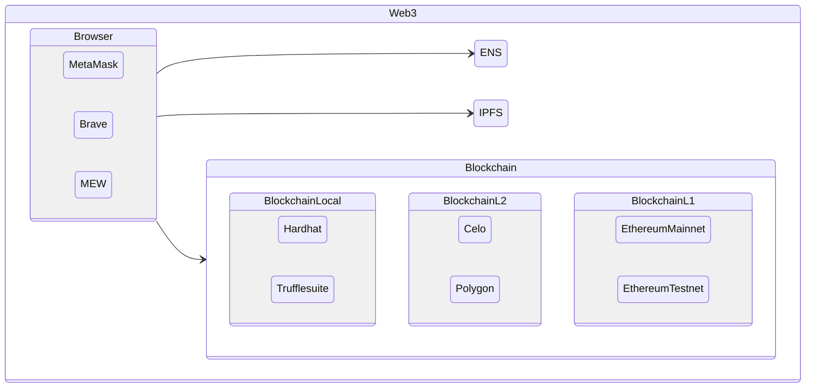

# weekly61

### Environment: local virtual environment 2022

#### First! Virtual Environment to work every day

> *Virtual Environment* help us be out of dependencies
> I mean dependencies from hour local environment for personal use of computer

> *Independent environment* just for the *sanity of the project*, and the others projects

> Clone Base System: Just after create a Simple Operating System Installation ( with or without GUI Desktop )
> Why Clone ? Because I need to check when I have added extra dependencies, or try new things fast.

> Docker: Clearly the end app must be in an environment like Docker, kubernetes, or simple local run docker as utility. Isolation of the environment ( versions of software like.. py2 py3, nodejs14 nodejs15, debian, alpine, libraries )


> ENV: Linux tools for Install to compile from Source Code any application
```tsx
# apt install build-essential linux-headers-amd64
```

> ENV: Download Virtual Box to install from source code, copiling it.
```tsx
https://download.virtualbox.org/virtualbox/6.1.38/VirtualBox-6.1.38-153438-Linux_amd64.run
```

> ENV: Change permision of the file, Executable +x
```tsx
# chmod +x VirtualBox-6.1.38-153438-Linux_amd64.run
```

> ENV: Execute the script that will download and compile from source code virtualbox
```
# ./VirtualBox-6.1.38-153438-Linux_amd64.run 
```

> ENV: Desktop Display config LXDE > Preferences > Monitor Settings > 1280x768 


## Conceptual Web 3 - Starting Point - Basic knowledge for a kind of Big Picture



```tsx
stateDiagram-v2
    state Web3 {
        direction LR
        state Browser {
            direction LR
            MetaMask
            Brave
            MEW
        }
        Browser --> ENS
        Browser --> IPFS
        Browser --> Blockchain
    }
    state Blockchain {
        state BlockchainLocal {
            direction LR
            Hardhat
            Trufflesuite
        }
        state BlockchainL2 {
            direction LR
            Celo
            Polygon
        }
        state BlockchainL1 {
            direction LR
            EthereumMainnet
            EthereumTestnet
        }
    }
```

### Install Environment Base in the Virtual Debian - Tools, browser web3, editors, git, step by step

> Git - source code version control manager / repository to interact with github
```tsx
su -
..
# apt install git
```
> Source Code Editor - vscode in this case.
```tsx
# curl https://packages.microsoft.com/keys/microsoft.asc | gpg --dearmor > microsoft.gpg
# install -o root -g root -m 644 microsoft.gpg /usr/share/keyrings/microsoft-archive-keyring.gpg
# sh -c 'echo "deb [arch=amd64,arm64,armhf signed-by=/usr/share/keyrings/microsoft-archive-keyring.gpg] https://packages.microsoft.com/repos/vscode stable main" > /etc/apt/sources.list.d/vscode.list'
# apt -y update && apt -y upgrade && apt -y install code
# exit
$ code
```
<https://wiki.debian.org/VisualStudioCode>


> Create a Folder for Projects
```
$ mkdir projects
$ cd projects
```
> Clone the repository where we are working to have the step by step guide.
```
$ git clone https://github.com/maximilianou/weekly61
```

> Docker - Install Docker to run isolated environments and tools
```tsx
# apt -y install apt-transport-https software-properties-common ca-certificates curl gnupg lsb-release && echo  'deb [arch=amd64] https://download.docker.com/linux/debian  bullseye stable' | tee /etc/apt/sources.list.d/docker.list > /dev/null &&  curl -fsSL https://download.docker.com/linux/debian/gpg | apt-key add - && add-apt-repository "deb [arch=amd64] https://download.docker.com/linux/debian bullseye stable" && apt -y update; apt -y remove docker docker-engine docker.io containerd runc && apt -y install docker-ce docker-ce-cli containerd.io && usermod -aG docker debian
```
<https://docs.docker.com/engine/install/debian/>

> Docker environment applied - restart your session or restart the virtual machine
```
# shutdown -r now
$ docker run hello-world
```


> Web 3 Browser - Brave install
```tsx
# apt install apt-transport-https curl
# curl -fsSLo /usr/share/keyrings/brave-browser-archive-keyring.gpg https://brave-browser-apt-release.s3.brave.com/brave-browser-archive-keyring.gpg
# echo "deb [signed-by=/usr/share/keyrings/brave-browser-archive-keyring.gpg arch=amd64] https://brave-browser-apt-release.s3.brave.com/ stable main" | tee /etc/apt/sources.list.d/brave-browser-release.list
# apt -y update && apt -y install brave-browser
```
<https://brave.com/linux/#release-channel-installation>


- nvm - nodejs - npm - npx
```tsx
curl -o- https://raw.githubusercontent.com/nvm-sh/nvm/v0.39.1/install.sh | bash
```
<https://github.com/nvm-sh/nvm>

---
DONE
---
- Install Virtual Environment - Operating System to work, can clean, and reinstall
- Conceptual Graph of Web 3 - Browser - Wallet - Blockchain - IPFS - ENS
- Git - Install Git Version Control System
- Code Editor - Install Editor - Source Code Editor
- Project in Repository - Create or Clone your project on Github ( Public if you can, to help others ) ( optional use Gitlab, Bitbucket.. radicle.. )
- Docker - Install Docker, we will need for many things, running tools like hardhat, executing little encapsulated tools without conflicting with our instalation system. Docker is so so cool for dev! I love It!, and later you can go to production with a clean docker image / little alpine linux ..
- Web 3 Browser - In this case we install Brave ( can be Opera o others )
- nvm - nodejs - npm - npx - Install Nodejs Javascript Typescript with Node Version Manager, so we can work in different projects with different versions of nodejs 12, 14, 16..

---
DOING:
---


---
TODO:
---

- hardhat - install EVM blockchain for Smart Contract in Solidity Local Network
- wallets - create wallet for development only
- 


